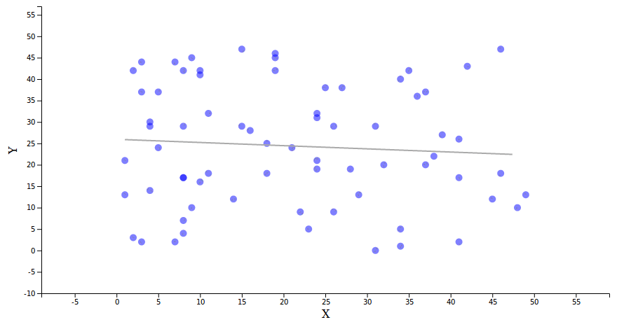

# residual-plot

Takes some data and a regression function, and plots either a scatterplot with a line of best fit or a bar chart of the sorted residuals. Optionally, it can do a simple linear regression for you.

## API Reference

<a name="window_residualPlot" href="#window_residualPlot">#</a> <i>window</i>.<b>residualPlot</b>() [<>](https://github.com/zmbc/residual-plot/blob/master/residual-plot.js "Source")

Returns a new residualPlot instance.

<a name="residualPlot_regressionFunction" href="#residualPlot_regressionFunction">#</a> <i>residualPlot</i>.<b>regressionFunction</b>([<i>regression</i>])

If *regression* is specified, uses *regression* to find the line of best fit for the data. *regression* should be a unary function mapping from domain x-values to domain y-values.

If *regression* is not specified, returns the regression function currently in use. Note that this will return `undefined` if the plot generates a regression function automatically. It will only return a function that has been manually set.

<a name="residualPlot_residualMode" href="#residualPlot_residualMode">#</a> <i>residualPlot</i>.<b>residualMode</b>([<i>residualMode</i>])

If *residualMode* is specified, sets the current mode of the chart. True means the plot will show the residuals in a bar chart format, false means the plot will show the raw data in a scatterplot format with a line of best fit.

If *residualMode* is not specified, returns a boolean signifying whether the plot is currently in residual mode.

<a name="residualPlot" href="#residualPlot">#</a> <i>residualPlot</i>(<i>selection</i>)

Draws the residual plot inside each item of *selection* with the data bound to that item. The data bound should be an array of objects.

### Encodings

The `x` and `y` calls are not always needed, because they have defaults. If not set, the plot will look for an `x` property and a `y` property on the data.

Likewise, if no identity function is passed to the plot, it will use index within the data array for identification.

<a name="residualPlot_x" href="#residualPlot_x">#</a> <i>residualPlot</i>.<b>x</b>([<i>x</i>])

If *x* is a constant, sets the x-value (independent variable) of all data points to *x*.

If *x* is a function, calls *x* with the current datum and the index (in that order) for each element. The return value of *x* is used as the x-value.

If *x* is not specified, returns the constant or function currently determining the x-value.

<a name="residualPlot_y" href="#residualPlot_y">#</a> <i>residualPlot</i>.<b>y</b>([<i>y</i>])

If *y* is a constant, sets the y-value (dependent variable) of all data points to *y*.

If *y* is a function, calls *y* with the current datum and the index (in that order) for each element. The return value of *y* is used as the y-value.

If *y* is not specified, returns the constant or function currently determining the y-value.

<a name="residualPlot_id" href="#residualPlot_id">#</a> <i>residualPlot</i>.<b>id</b>([<i>idFunction</i>])

If *idFunction* is specified, calls *idFunction* with the current datum and the index (in that order) for each element in order to determine the unique identity of each datum.

If *idFunction* is not specified, returns the identification function currently in use.

### Axis Titles

Axis titles are set separately for the scatterplot and bar chart modes. This is because the axes represent different things in the two modes and it would be cumbersome to have to switch back and forth.

<a name="residualPlot_scatterAxisTitleX" href="#residualPlot_scatterAxisTitleX">#</a> <i>residualPlot</i>.<b>scatterAxisTitleX</b>([<i>title</i>])

If *title* is specified, sets the plot's x axis title **while in scatterplot mode** to *title*.

If *title* is not specified, returns the the scatterplot's current x axis title.

<a name="residualPlot_scatterAxisTitleY" href="#residualPlot_scatterAxisTitleY">#</a> <i>residualPlot</i>.<b>scatterAxisTitleY</b>([<i>title</i>])

If *title* is specified, sets the plot's y axis title **while in scatterplot mode** to *title*.

If *title* is not specified, returns the the scatterplot's current y axis title.

<a name="residualPlot_barAxisTitleX" href="#residualPlot_barAxisTitleX">#</a> <i>residualPlot</i>.<b>barAxisTitleX</b>([<i>title</i>])

If *title* is specified, sets the plot's x axis title **while in bar chart mode** to *title*.

If *title* is not specified, returns the the bar chart's current x axis title.

<a name="residualPlot_barAxisTitleY" href="#residualPlot_barAxisTitleY">#</a> <i>residualPlot</i>.<b>barAxisTitleY</b>([<i>title</i>])

If *title* is specified, sets the plot's y axis title **while in bar chart mode** to *title*.

If *title* is not specified, returns the the bar chart's current y axis title.

### Hover

Two events, `mouseover` and `mouseout`, can be bound on the points. These are useful for hover effects and tooltips.

<a name="residualPlot_pointOnMouseover" href="#residualPlot_pointOnMouseover">#</a> <i>residualPlot</i>.<b>pointOnMouseover</b>([<i>handler</i>])

If *handler* is specified, sets the plot's handler for mouseovers on the points to *handler*.

If *handler* is not specified, returns plot's current handler for mouseovers on the points.

<a name="residualPlot_pointOnMouseout" href="#residualPlot_pointOnMouseout">#</a> <i>residualPlot</i>.<b>pointOnMouseout</b>([<i>handler</i>])

If *handler* is specified, sets the plot's handler for mouseouts on the points to *handler*.

If *handler* is not specified, returns plot's current handler for mouseouts on the points.

### Styling

Note: While almost all the time, you'll want to call these with constants, all of them except `barColorPositive` and `barColorNegative` actually accept functions as well, because they are passed directly on to `d3.attr`. Use wisely.

#### Points

<a name="residualPlot_pointOpacity" href="#residualPlot_pointOpacity">#</a> <i>residualPlot</i>.<b>pointOpacity</b>([<i>opacity</i>])

If *opacity* is specified, sets the opacity of the points to *opacity*.

If *opacity* is not specified, returns plot's current point opacity.

<a name="residualPlot_pointSize" href="#residualPlot_pointSize">#</a> <i>residualPlot</i>.<b>pointSize</b>([<i>radius</i>])

If *radius* is specified, sets the radius of the points to *radius*.

If *radius* is not specified, returns plot's current point radius.

<a name="residualPlot_pointColor" href="#residualPlot_pointColor">#</a> <i>residualPlot</i>.<b>pointColor</b>([<i>color</i>])

If *color* is specified, sets the size of the points to *color*.

If *color* is not specified, returns plot's current point color.

#### Bars

<a name="residualPlot_barOpacity" href="#residualPlot_barOpacity">#</a> <i>residualPlot</i>.<b>barOpacity</b>([<i>opacity</i>])

If *opacity* is specified, sets the opacity of the bars to *opacity*.

If *opacity* is not specified, returns plot's current bar opacity.

<a name="residualPlot_barColorPositive" href="#residualPlot_barColorPositive">#</a> <i>residualPlot</i>.<b>barColorPositive</b>([<i>color</i>])

If *color* is specified, sets the color of the bars corresponding to positive residuals to *color*.

If *color* is not specified, returns plot's current bar color for positive residuals.

<a name="residualPlot_barColorNegative" href="#residualPlot_barColorNegative">#</a> <i>residualPlot</i>.<b>barColorNegative</b>([<i>color</i>])

If *color* is specified, sets the color of the bars corresponding to negative residuals to *color*.

If *color* is not specified, returns plot's current bar color for negative residuals.

#### Line

<a name="residualPlot_lineOpacity" href="#residualPlot_lineOpacity">#</a> <i>residualPlot</i>.<b>lineOpacity</b>([<i>opacity</i>])

If *opacity* is specified, sets the opacity of the line to *opacity*.

If *opacity* is not specified, returns plot's current line opacity.

<a name="residualPlot_lineWidth" href="#residualPlot_lineWidth">#</a> <i>residualPlot</i>.<b>lineWidth</b>([<i>width</i>])

If *width* is specified, sets the width (thickness) of the line to *width*.

If *width* is not specified, returns plot's current line width.

<a name="residualPlot_lineColor" href="#residualPlot_lineColor">#</a> <i>residualPlot</i>.<b>lineColor</b>([<i>color</i>])

If *color* is specified, sets the color of the line to *color*.

If *color* is not specified, returns plot's current line color.

### Size and Margins

<a name="residualPlot_width" href="#residualPlot_width">#</a> <i>residualPlot</i>.<b>width</b>([<i>width</i>])

If *width* is specified, sets the plot's width to *width* pixels.

If *width* is not specified, returns plot's current width in pixels.

<a name="residualPlot_height" href="#residualPlot_height">#</a> <i>residualPlot</i>.<b>height</b>([<i>height</i>])

If *height* is specified, sets the plot's height to *height* pixels.

If *height* is not specified, returns plot's current height in pixels.

<a name="residualPlot_marginTop" href="#residualPlot_marginTop">#</a> <i>residualPlot</i>.<b>marginTop</b>([<i>margin</i>])

If *margin* is specified, sets the plot's top exterior margin (outside the drawing area) to *margin* pixels.

If *margin* is not specified, returns plot's current top exterior margin in pixels.

<a name="residualPlot_marginRight" href="#residualPlot_marginRight">#</a> <i>residualPlot</i>.<b>marginRight</b>([<i>margin</i>])

If *margin* is specified, sets the plot's right exterior margin (outside the drawing area) to *margin* pixels.

If *margin* is not specified, returns plot's current right exterior margin in pixels.

<a name="residualPlot_marginBottom" href="#residualPlot_marginBottom">#</a> <i>residualPlot</i>.<b>marginBottom</b>([<i>margin</i>])

If *margin* is specified, sets the plot's bottom exterior margin (outside the drawing area) to *margin* pixels.

If *margin* is not specified, returns plot's current bottom exterior margin in pixels.

<a name="residualPlot_marginLeft" href="#residualPlot_marginLeft">#</a> <i>residualPlot</i>.<b>marginLeft</b>([<i>margin</i>])

If *margin* is specified, sets the plot's left exterior margin (outside the drawing area) to *margin* pixels.

If *margin* is not specified, returns plot's current left exterior margin in pixels.

### Padding

As in CSS, 'padding' here refers to space *inside* the chart. This applies only to the data points, not to axes. It's used to give the points a little breathing room.

#### Scatterplot Mode

<a name="residualPlot_scatterPaddingTop" href="#residualPlot_scatterPaddingTop">#</a> <i>residualPlot</i>.<b>scatterPaddingTop</b>([<i>padding</i>])

If *padding* is specified, sets the plot's top padding **while in scatterplot mode** to *padding* domain units (the same units as the data y-values).

If *padding* is not specified, returns the scatterplot's current top padding in domain units.

<a name="residualPlot_scatterPaddingRight" href="#residualPlot_scatterPaddingRight">#</a> <i>residualPlot</i>.<b>scatterPaddingRight</b>([<i>padding</i>])

If *padding* is specified, sets the plot's right padding **while in scatterplot mode** to *padding* domain units (the same units as the data y-values).

If *padding* is not specified, returns the scatterplot's current right padding in domain units.

<a name="residualPlot_scatterPaddingBottom" href="#residualPlot_scatterPaddingBottom">#</a> <i>residualPlot</i>.<b>scatterPaddingBottom</b>([<i>padding</i>])

If *padding* is specified, sets the plot's bottom padding **while in scatterplot mode** to *padding* domain units (the same units as the data y-values).

If *padding* is not specified, returns the scatterplot's current bottom padding in domain units.

<a name="residualPlot_scatterPaddingLeft" href="#residualPlot_scatterPaddingLeft">#</a> <i>residualPlot</i>.<b>scatterPaddingLeft</b>([<i>padding</i>])

If *padding* is specified, sets the plot's left padding **while in scatterplot mode** to *padding* domain units (the same units as the data y-values).

If *padding* is not specified, returns the scatterplot's current left padding in domain units.

#### Bar Chart Mode

<a name="residualPlot_barPaddingTop" href="#residualPlot_barPaddingTop">#</a> <i>residualPlot</i>.<b>barPaddingTop</b>([<i>padding</i>])

If *padding* is specified, sets the plot's top padding **while in bar chart mode** to *padding* domain units (the same units as the data y-values).

If *padding* is not specified, returns the bar chart's current top padding in domain units.

<a name="residualPlot_barPaddingBottom" href="#residualPlot_barPaddingBottom">#</a> <i>residualPlot</i>.<b>barPaddingBottom</b>([<i>padding</i>])

If *padding* is specified, sets the plot's bottom padding **while in bar chart mode** to *padding* domain units (the same units as the data y-values).

If *padding* is not specified, returns the bar chart's current bottom padding in domain units.

<a name="residualPlot_barPaddingOuter" href="#residualPlot_barPaddingOuter">#</a> <i>residualPlot</i>.<b>barPaddingOuter</b>([<i>padding</i>])

If *padding* is specified, sets the plot's left and right padding **while in bar chart mode** to *padding* number of bar widths. **Because this uses d3.scaleBand(), which [has a bug](https://github.com/d3/d3-scale/issues/102), this value must be less than or equal to 1.**

If *padding* is not specified, returns the bar chart's current left and right padding in bar widths.

<a name="residualPlot_barPaddingInner" href="#residualPlot_barPaddingInner">#</a> <i>residualPlot</i>.<b>barPaddingInner</b>([<i>padding</i>])

If *padding* is specified, sets the plot's between-bar padding to *padding* number of bar widths.

If *padding* is not specified, returns plot's between-bar padding in bar widths.

### Animation Timing

<a name="residualPlot_scatterUpdateDuration" href="#residualPlot_scatterUpdateDuration">#</a> <i>residualPlot</i>.<b>scatterUpdateDuration</b>([<i>duration</i>])

If *duration* is specified, sets the plot's update time **while in scatterplot mode** to *duration* number of milliseconds.

If *duration* is not specified, returns the scatterplot's current update time in milliseconds.

#### Transitioning Between Modes

When the plot switches modes, it does so one axis at a time. When switching from scatterplot to bar chart mode, the y axis adjusts before the points sort themselves horizontally. When switching from bar chart to scatterplot mode, the points return to their x positions before the y axis shifts.

<a name="residualPlot_firstAxisUpdateDuration" href="#residualPlot_firstAxisUpdateDuration">#</a> <i>residualPlot</i>.<b>firstAxisUpdateDuration</b>([<i>duration</i>])

If *duration* is specified, sets the plot's first axis to transition for *duration* number of milliseconds.

If *duration* is not specified, returns plot's current first axis transition time in milliseconds.

<a name="residualPlot_secondAxisUpdateDuration" href="#residualPlot_secondAxisUpdateDuration">#</a> <i>residualPlot</i>.<b>secondAxisUpdateDuration</b>([<i>duration</i>])

If *duration* is specified, sets the plot's second axis to transition for *duration* number of milliseconds, after the first axis transition has completed.

If *duration* is not specified, returns plot's current second axis transition time in milliseconds.

#### Added and Removed

<a name="residualPlot_pointEnterDuration" href="#residualPlot_pointEnterDuration">#</a> <i>residualPlot</i>.<b>pointEnterDuration</b>([<i>duration</i>])

If *duration* is specified, sets new points to fade in for *duration* number of milliseconds.

If *duration* is not specified, returns plot's current point entering transition time in milliseconds.

<a name="residualPlot_pointExitDuration" href="#residualPlot_pointExitDuration">#</a> <i>residualPlot</i>.<b>pointExitDuration</b>([<i>duration</i>])

If *duration* is specified, sets old points to fade out for *duration* number of milliseconds.

If *duration* is not specified, returns plot's current point exiting transition time in milliseconds.

<a name="residualPlot_barEnterDuration" href="#residualPlot_barEnterDuration">#</a> <i>residualPlot</i>.<b>barEnterDuration</b>([<i>duration</i>])

If *duration* is specified, sets new bars to "grow" in for *duration* number of milliseconds.

If *duration* is not specified, returns plot's current bar entering transition time in milliseconds.

<a name="residualPlot_barExitDuration" href="#residualPlot_barExitDuration">#</a> <i>residualPlot</i>.<b>barExitDuration</b>([<i>duration</i>])

If *duration* is specified, sets old bars to fade out for *duration* number of milliseconds.

If *duration* is not specified, returns plot's current bar exiting transition time in milliseconds.
